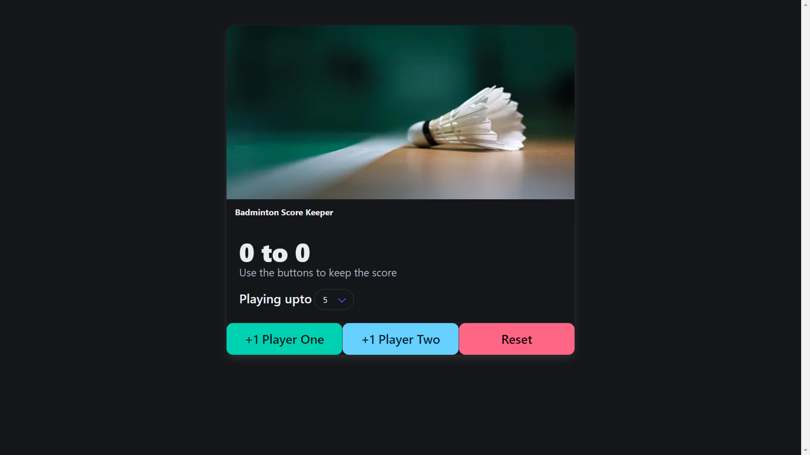

# 🏸 Score Keeper

A simple and intuitive scorekeeper web app to keep track of game scores for sports like badminton, tennis, and similar 3-set match games. This app is built using **HTML**, **CSS** (Bulma), and **JavaScript**. Whether you're playing casually or competitively, this app makes tracking scores easy and fun!

## ✨ Features

- 🎯 **Score Tracking**: Keep track of scores for two players in real-time.
- 🏆 **Customizable Target Score**: Choose the winning score from a dropdown (3 to 20 points).
- 🔁 **Reset Functionality**: Reset the scores at any time to start a new match.
- 📱 **Responsive Design**: Built using **Bulma CSS**, making it mobile-friendly and visually appealing.

## 🛠️ How It Works

1. **Score Keeping**:
   - Two players (Player One and Player Two) are displayed with their respective scores.
   - Use the buttons labeled `+1 Player One` and `+1 Player Two` to increase their scores.
   
2. **Set the Winning Score**:
   - Use the dropdown menu labeled "Playing upto" to set the desired target score.
   - The game ends when one of the players reaches the set score.

3. **End of Game**:
   - When a player reaches the winning score, their score turns **green** (winner) while the other player’s score turns **red** (loser).
   - The buttons become disabled to prevent further score increments.

4. **Resetting the Game**:
   - Press the `Reset` button to start a new game. Scores will be reset to `0`, and buttons will be re-enabled for both players.

## 💻 Technologies Used

- **HTML**: For structuring the content of the web page.
- **CSS (Bulma)**: For responsive and modern styling.
- **JavaScript**: For adding interactivity and functionality to the scorekeeping logic.

## 📸 Screenshots

### 🍣 1️⃣ Main Page

## 📋 Usage

1. Open the app in any web browser.
2. Select the target score for the game from the dropdown menu (default is 3).
3. Use the buttons to track each player's score.
4. Once a player reaches the target score, the game will end with the winner and loser visually indicated.
5. Click the **Reset** button to restart the game and play again.

## 🚀 How the Code Works

- **HTML Structure**:  
  The layout is divided into a **Bulma card component** which displays the game, buttons for scorekeeping, and a dropdown for selecting the winning score.
  
- **JavaScript Logic**:
  - Players' scores are stored in objects (`u` and `e` for Player One and Player Two).
  - The `updateScores()` function increments the score of a player when a button is clicked.
  - The target score is dynamically set based on the selection from the dropdown, and once a player reaches the score, the game is marked as over.
  - The `reset()` function restores the game state to its default values, clearing scores and re-enabling buttons.
  
- **CSS (Bulma)**:
  - Bulma provides the structure and responsiveness, while custom styling is used to highlight the winner (green) and the loser (red).

---

Enjoy keeping score with ease using this simple and responsive scorekeeper app! 🎮🏅
